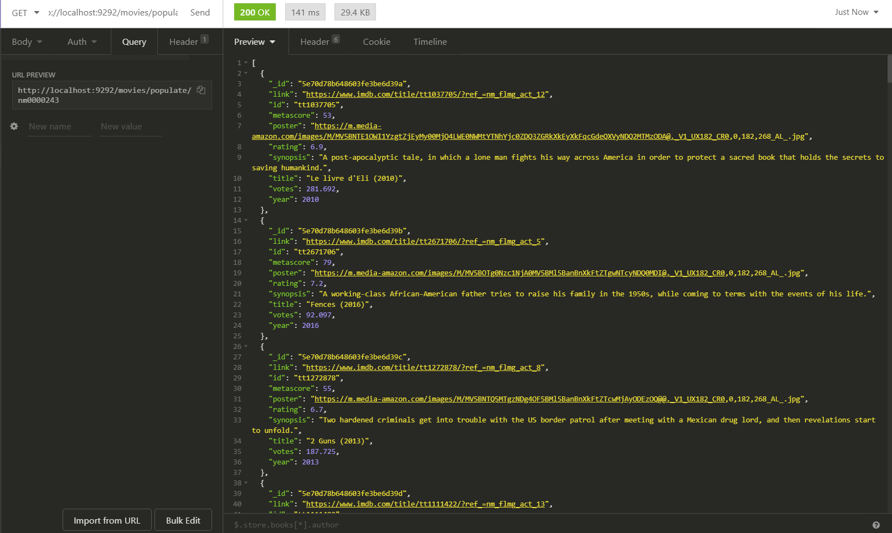
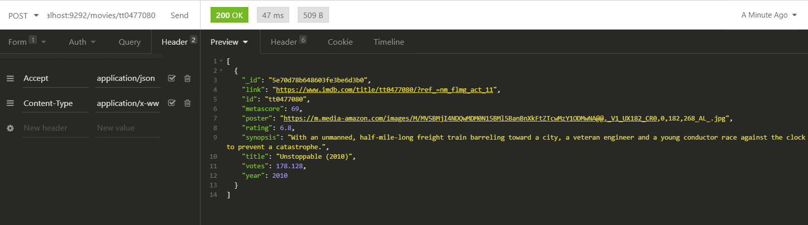
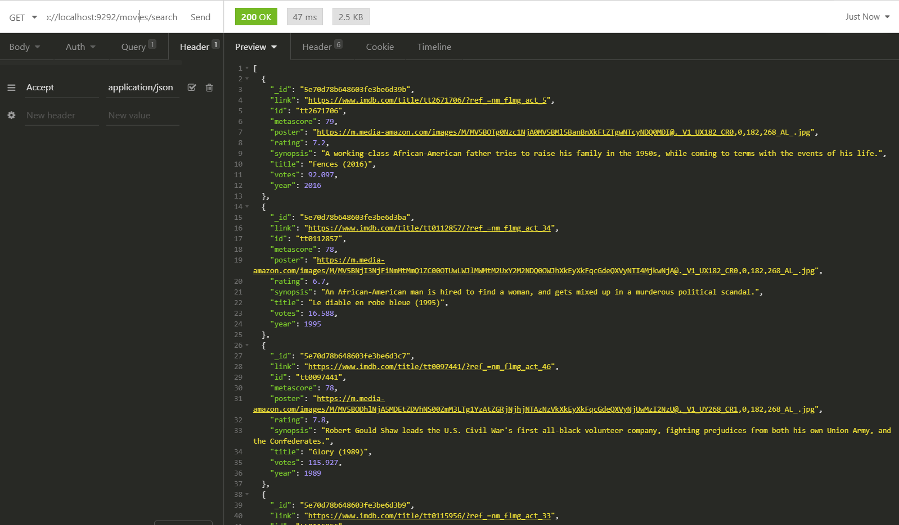
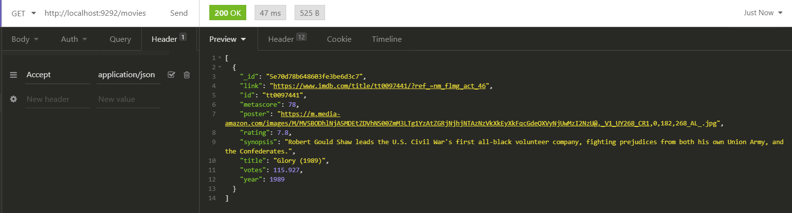
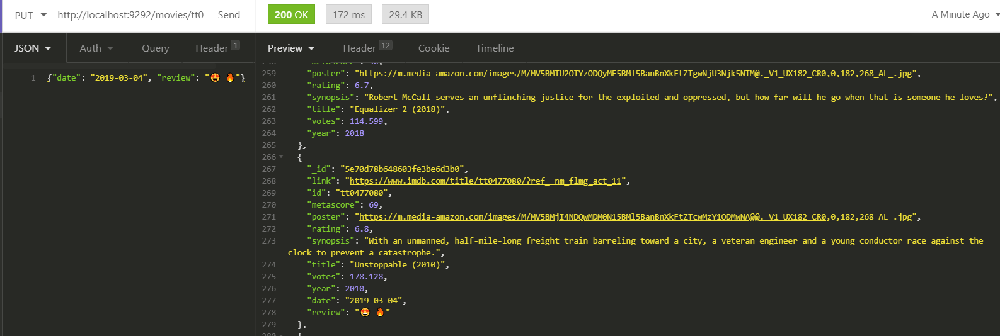
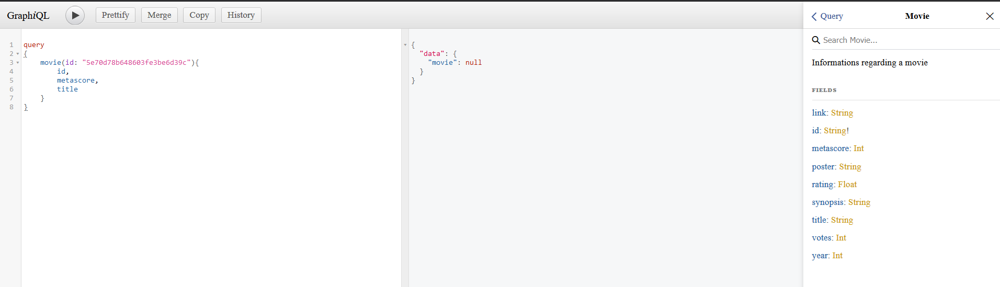

# REST API

I managed to make some requests with the REST API:

1. Populating the database  

2. Searching for a specific movie with its ID:  

3. Searching movies with a metascore higher than 70:  

4. Searching for a random movie:  

5. Saving a date and review:  

# GraphQL

Sadly I did not manage to get results with GraphQL:

